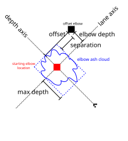
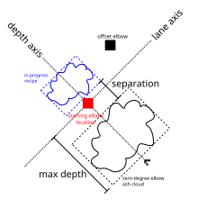
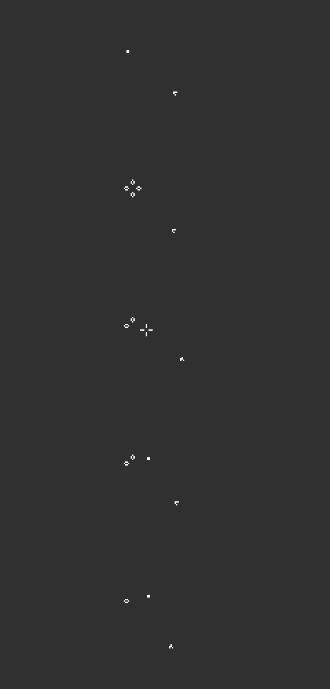
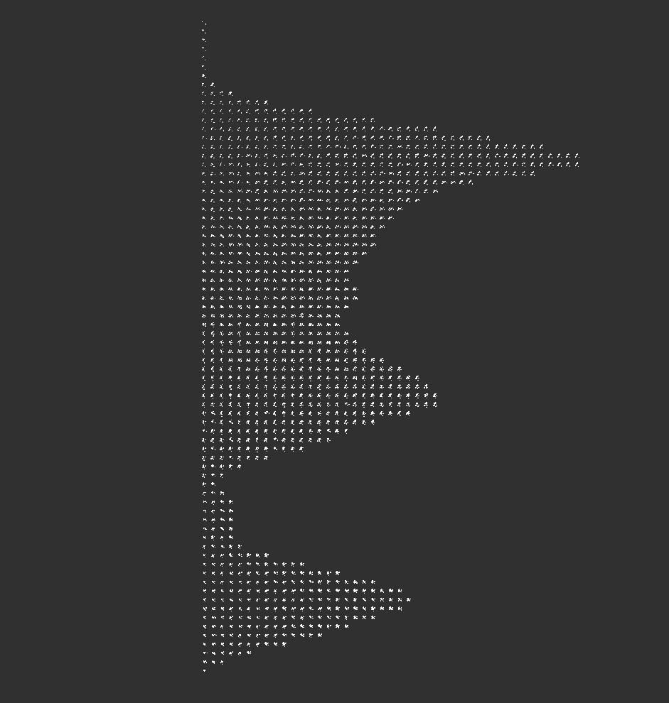
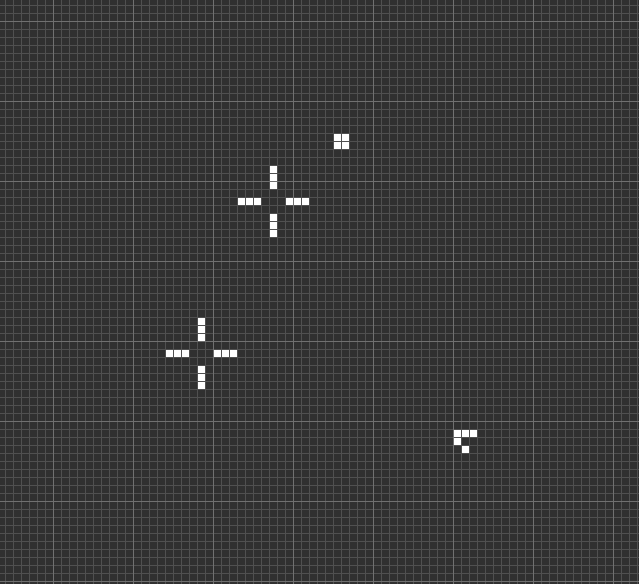

# Search scripts to optimize the Snarkmaker recipe

The [Snarkmaker](https://conwaylife.com/wiki/Snarkmaker) is a recipe
which uses ~2400 gliders on a single lange track to construct a
snark on the lane to reflect the gliders.

The original Snarkmaker recipe is compiled from a library of composable
recipes which start with an elbow block in a known location, have some
effect, like creating an offset block, or emitting a glider on a certain
lane, then return to a block. This library makes it easy to assemble any
recipe, but is not necessarily the most efficient for a specific recipe.

This search program searches for an optimized recipe which builds up the
snark step by step, not returning to any particular configuration
inbetween. For this we need to have a score for how close we are to
guide the search.

## Finding an offset elbow

The first step of the search is to find an offset elbow. This is
a block or equivalent still life that is far away on the lane axis.
This will become the starting elbow after the snark is complete.

- Gliders come from the SE on lane 0, hitting the starting elbow.
- Offset/separation: The offset block should be far away from the rest of the
pattern to avoid interfering with the rest of construction, and to give us
more options for follow-up recipes once the snark is complete.
- Elbow depth/max depth: increasing the elbow depth and decreasing the max
  depth helps when chaining the snarkmaker recipe multiple times. If the
  recipe extends far back along the depth axis during construction, it will
  interfere with the previous snark.
- Elbow ash cloud: all things equal, a smaller ash cloud is more manageable
  and increases our chances that we can clean up at the end.

## Constructing the snark

The original Snarkmaker recipe worked using a zero degree elbow.
Using the library of composable recipes, an average of 25 gliders on lane 0
with specific spacings was able to emit one slow glider on a specific parallel
lane and return to a zero degree elbow. Combining these implemented the known
90 glider single-sided slow salvo for a snark.

Today, we know a 73 glider recipe for a snark, and we can search for recipes that
go directly from one arbitrary ash cloud to another.

The diagram shows the criteria we will use to guide the search.

- Offset elbow: The offset elbow fixes one or two locations for the snark --
  the output gliders need to hit the elbow in the right location.
- Max depth: as before, decreasing the max depth makes it easier to chain
  our new snarkmaker recipe.
- Zero-degree elbow ash cloud: as before, a smaller ash cloud is more manageable
and increases our changes that we can clean up at the end.
- Separation: The zero-degree elbow ash cloud might overlap the in-progress
  recipe, but that runs the risk of some ash hiding behind the recipe in a way
  that's hard to clean up. Some separation between the zones helps.
  However, a smaller separation increases the chances we find a lucky reaction
  which does the work of multiple slow gliders. So, the separation should be
  not too big either.
- In-progress recipe: We have a 73 glider slow-salvo recipe which starts with a
  block, so if the in-progress recipe is a match for one of the intermediate
  stages, we know how many slow gliders are needed to finish construction. We can
  also consider partial matches weighted by the rarity of the missing components.
  
  For example, here are the first few steps of the recipe:
  

  However, the 73 glider recipe is actually a whole family of recipes -- at many
  points, we have options for which glider to send next.
  Here's a sample of the options found by trying the same set of gliders
  in different orders. The first six gliders are fixed, after that it quickly
  grows into many possibilities. There are often separate areas of the constellation
  which we can make progress on independently. This gives our search more freedom
  to make progress at any given step.
  

  There are some precursors that are quite simple, such as this
  constellation of 2 traffic lights and a block. It normally takes 11 slow
  gliders to turn a block into this pattern, but it's conceivable that we
  could find this directly in our ash and skip ahead several stages.

  

  When we consider the "in-progress recipe" and "zero degree elbow ash cloud",
  it is relative to one of these intermediate precursors. Ash components which match
  the intermediate stages are considered "in-progress recipe", and others are
  considered part of the "zero degree elbow ash cloud".

  We combine the scores for each intermediate recipe weighted by the distance
  from the final step to get the final score.

## Sqlite Database Format

The actual results are stored in a Sqlite database file. There is a SQL VIEW named `r` which includes the result row and joins it with other useful information. `r` has these fields:

- **stream**: The stream of follow-up gliders to add to the starting point. Saved as a blob, with each byte representing the gap between one glider and the next.

- **starting_point**: The ID of the starting point, a previous result that we searched deeper in this search.

- **digest**: The hash of the final stable state of the result.

- **before_hit_digest**: The hash of the state just when the last glider of the stream hits the point where the first glider of the stream started. If results have the same before_hit_digest, then they are the exact same pattern, so we try to prune the search and only explore one of them.

- **x**: The x coordinate of the final stable state of the result. Used to distinguish between results that have the same ash (from `digest`), but translated.

- **y**: The y coordinate of the final stable state of the result. Used to distinguish between results that have the same ash (from `digest`), but translated.

- **offset_block_lane**: The lane number of the block that will become the elbow after the snark is created. The elbow must be a still life (not necessarily a block) placed so that a reflected glider can hit it and create a standard pi explosion. It must also be on the furthest lane of any of the ash objects. Lanes are calculated by dividing the ash into connected components and finding the max lane of the bounding corners of each component -- this is simpler than calculating a true bounding box cell-by-cell.

- **lane_width**: The lane width of the stable state, excluding the offset block that will become the elbow. Lanes are calculated by dividing the ash into connected components and finding the max lane of the bounding corners of each component -- this is simpler than calculating a true bounding box cell-by-cell.

- **max_depth**: The maximum depth this pattern has reached during its evolution. Calculated as the max of `sp_max_depth` and `depth`.

- **depth**: The depth of the pattern. Calculated by dividing the ash into components, and finding the max of the bottom-right corner (x+w, y+h) of each component's bounding box. This includes the offset block as a component.

- **population**: The population of the final stable state.

- **flipped_offset_block**: If the lane number of the offset block was negative, then we will set this to true and use a different initial target block so that the offset block lane becomes positive.

- **full_intermediate**: Based on the position of the offset block, we calculate where the snark must be located. For each offset block, there is only one possible position due to glider color. If the final ash contains every component of one of the intermediate steps of the snark recipe, then this is set to the ID of that intermediate. If there are multiple recipe intermediates that match, this is the one with the largest population.

- **full_intermediate_depth_separation**: The separation between the furthest depth of the components of the full intermediate match and the rest of the components of the ash. A small or negative value indicates there could be/is overlap.

- **full_intermediate_overlapping_population**: Adds up the population of each component of the ash which isn't part of the full recipe intermediate match, but has a depth <= the depth of the recipe intermediate.

- **full_intermediate_overlapping_digest**: The hash of the pattern containing the components which have a depth <= the depth of the recipe intermediate. Useful to explore how the overlapping parts are modified or cleaned up by reactions.

- **full_intermediate_shift**: How far the intermediate is shifted towards negative depth to line up with the offset block.

- **partial_intermediate**: Based on the position of the offset block, we calculate where the snark must be located. For each offset block, there is only one possible position due to glider color. If the final ash contains some component of one of the intermediate steps of the snark recipe, then this is set to the ID of that intermediate. If there are multiple recipe intermediates that match, this is the one with the best log_prob.

- **partial_intermediate_log_prob**: A very rough approximation of how rare the missing pieces of the recipe are -- how likely is it that we will be able to find the rest of them through random search. Calculated as the sum of the log of the probability of each component, based on the occurence statistics in https://conwaylife.com/wiki/Most_common_objects_on_Catagolue. This means each log prob is a negative number, with higher numbers better. We only include the most common objects, so pieces like the heart of the snark have a log prob of -Infinity. Depending on the `--partial-progress-factor` parameter, intermediates which are closer to the finish get a bonus.

- **partial_intermediate_positive_log_prob**: A very rough approximation of how rare the matching pieces of the recipe are -- how lucky we are that we've made it this far. Calculated the same way as partial_intermediate_log_prob, but with no bonus for `--partial-progress-factor`. For this, a more negative value is better.

- **partial_intermediate_depth_separation**: The separation between the furthest depth of the components of the partial intermediate match and the rest of the components of the ash. A small or negative value indicates there could be/is overlap.

- **partial_intermediate_overlapping_population**: Adds up the population of each component of the ash which isn't part of the partial recipe intermediate match, but has a depth <= the depth of the recipe intermediate.

- **partial_intermediate_shift**: How far the intermediate is shifted towards negative depth to line up with the offset block.

- **fi_so_far**: If there is a full intermediate match, then this is the stream of zero-degree slow gliders that would turn a block into the full intermediate. This is a blob of byte pairs -- each pair is (lane, phase).

- **fi_remaining**: If there is a full intermediate match, then this is the stream of zero-degree slow gliders that could finish turning the full intermediate into a snark. This is a blob of byte pairs -- each pair is (lane, phase).

- **fi_digest**: If there is a full intermediate match, the digest of the intermediate pattern.

- **fi_rle_string**: If there is a full intermediate match, the run-length encoded pattern of the intermediate.

- **fi_x**: If there is a full intermediate match, the x coordinate of the intermediate. The rle string should be offset by `fi_x` and `fi_y` to find its true position.

- **fi_y**: If there is a full intermediate match, the y coordinate of the intermediate. The rle string should be offset by `fi_x` and `fi_y` to find its true position.

- **pi_so_far**: The same as `fi_so_far`, but for the partial intermediate.

- **pi_remaining**: The same as `fi_remaining`, but for the partial intermediate.

- **pi_digest**: The same as `fi_digest`, but for the partial_intermediate.

- **pi_x**: The same as `fi_x`, but for the partial_intermediate.

- **pi_y**: The same as `fi_y`, but for the partial_intermediate.

- **sp_cost**: The cost of the starting point of the search which led to this result. Depending on the `--reset-costs` parameter, this is either the sum of the separation distances of the gliders, or it is zero.

- **sp_stream**: The glider stream of the starting point of the search which led to this result.

- **sp_follow_up_gen_limit**: Not used.

- **sp_max_depth**: The max depth of the starting point. The maximum depth we've seen in any of the results which have become starting points in a search. We don't calculate the actual envelope of the reaction, so it will probably extend past this during unstable portion of the reaction.

- **full_stream**: The concatenation of the `sp_stream` and `stream`, for the full stream of single channel gliders.